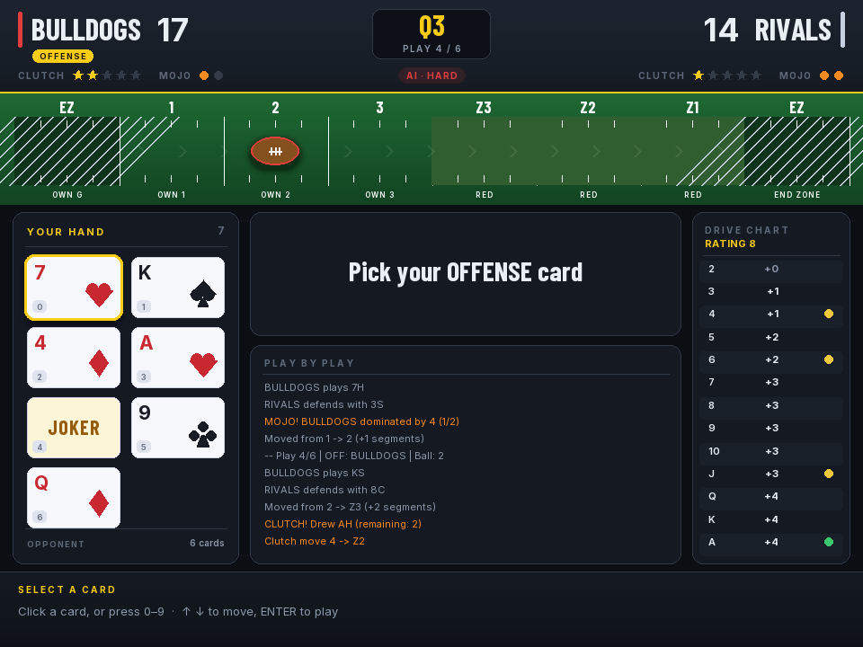

# Clutch Card Football

A card football game built with Pygame. Two teams face off over four quarters,
playing cards from their hands to drive the ball down the field and score
touchdowns and field goals.



## Broadcast UI

The 960×720 presentation is organized like a live sports broadcast: a compact
score bar, a mirrored turf field, a two-column card hand, phase-aware play and
log panels, a drive-chart rail, and a full-width action bar. Every choice can be
made with either the mouse or keyboard, and the nine-card Q4 hand fits without
overlapping its opponent-count footer.

## How to Launch

This is a desktop build. The `pygbag`/WASM browser shell was retired on
2026-08-07; see the root [README](../README.md). A browser edition is being
rebuilt around a FastAPI service and a React frontend rather than WASM, so this
Pygame UI stays desktop-only and shares the same `ccf/` engine.

### macOS

```bash
# Install Python 3.10+ if not already installed
brew install python

# Install pygame-ce
pip3 install pygame-ce

# Run the game
cd ccf_pygame
python3 game.py
```

### Windows

```powershell
# Install Python 3.10+ from https://www.python.org/downloads/
# Make sure to check "Add Python to PATH" during installation

# Install pygame-ce
pip install pygame-ce

# Run the game
cd ccf_pygame
python game.py
```

## Game Rules

### Overview

Clutch Card Football is a card-based football game played over **4 quarters**. Each quarter has 6 plays 
(8 in Q4). One team is on offense, the other on defense. The offense tries to move the ball down the field to score; 
the defense tries to stop them.

### Setup

Each team has three ratings:

| Rating | Range | Description |
|--------|-------|-------------|
| **Team Rating** | 1-12 | Determines how far cards move the ball (higher = better) |
| **Kick Rating** | 1-3 | Affects punts, short punts, and field goal accuracy |
| **Clutch Coins** | 0-5 | Special plays that draw a bonus card from the deck |

Each team also picks a **color** (Red or Black) which affects bonus movement when playing cards that match your team color.

### AI Difficulty

The setup screen has an **AI DIFFICULTY** selector that changes how smartly the robot plays (team ratings are unaffected):

| Level | Behavior |
|-------|----------|
| **Easy** | Random card picks and wasteful decisions — punts in the red zone, burns clutch coins |
| **Medium** | Solid heuristics: picks the best-movement card from the drive chart, plays high cards on defense to earn mojo, uses clutch/FG sensibly |
| **Hard** | Monte Carlo search: simulates the remaining deck to pick the card/action with the best expected outcome, and makes smart extra-point calls |

The current difficulty is shown in the top scoreboard bar.

### The Field

The field has 7 segments the ball moves through:

```
OWN 1 -> OWN 2 -> OWN 3 -> RED ZONE Z3 -> RED ZONE Z2 -> RED ZONE Z1 -> END ZONE
```

- The ball starts at **segment 1** each drive
- Moving past Z1 into the End Zone scores a **Touchdown**
- Moving backwards past segment 1 results in a **Safety**

### Card Play

Each play works like this:

1. **Offense plays a card** from their hand
2. **Defense plays a card** from their hand
3. Cards are compared by rank (2 lowest, Ace=14, Joker=15)

The offense card is then looked up on the **Drive Chart** using the offense team's rating to determine movement (0-5 segments forward, or -1 backwards for low cards).

Higher-rated teams get more movement from the same cards. A rating-12 team playing a 2 still moves forward 1 segment, while a rating-1 team moves backwards.

### Card Comparison Outcomes

**Normal Play**: Regardless of who "wins" the card battle, the offense card always determines movement via the drive chart. However:

- **Defense wins the card battle** (higher card): Defense earns **Mojo** (see below)
- **Offense wins by 4+**: Offense earns **Mojo**

**WAR** (tied card values): A card is drawn from the deck.
- If it matches the offense's color: offense advances to **Z3** (Red Zone)
- If it matches the defense's color: **Turnover!** Defense gets the ball at segment 3

**Joker played by Offense**:
- If defense card < 4 (2-3): Automatic **Touchdown**
- If defense card < Jack (4-10): Advance **+3 segments**
- If defense card is Jack through Ace (11-14): Advance **+1 segment**

**Joker played by Defense**:
- If offense card < 4 (2-3): Automatic **defensive Touchdown** (extra-point attempt follows)
- If offense card < Jack (4-10): **Turnover!** Defense gets the ball at **Z3** (Red Zone)
- If offense card is Jack through Ace (11-14): **No gain** — offense keeps the ball at the same spot

### Color Bonus

When you play a card that **matches your team's color** (e.g., a Heart/Diamond for a Red team), some drive chart entries give **+1 bonus movement**. Higher-rated teams get more bonus opportunities.

### After Each Play

After the ball moves, the offense chooses one action:

| Action | Available | Effect |
|--------|-----------|--------|
| **Punt** | Always | Kicks the ball back (roll 1d6 + kick rating) segments. Opponent gets possession |
| **Field Goal** | Red Zone only (Z1/Z2/Z3) | Roll 1d6 + kick rating vs target. Success = **3 points** |
| **Clutch** | If coins remaining | Spend a clutch coin, draw a card from the deck, and move again |
| **Short Punt** | Red Zone only | Shorter kick (3 - kick rating + 0-2). Opponent gets possession |

### Field Goal Targets

| Position | Target Number | With Kick 1 | With Kick 2 | With Kick 3 |
|----------|--------------|-------------|-------------|-------------|
| Z3 | 7 | Need 6 (17%) | Need 5+ (33%) | Need 4+ (50%) |
| Z2 | 5 | Need 4+ (50%) | Need 3+ (67%) | Need 2+ (83%) |
| Z1 | 4 | Need 3+ (67%) | Need 2+ (83%) | Always (100%) |

### Scoring

| Score | Points |
|-------|--------|
| **Touchdown** | 6 points |
| **Extra Point** (after TD) | Roll 2d6: total < 5 = 0 pts, 5-10 = 1 pt, 11-12 = 2 pts |
| **Field Goal** | 3 points |
| **Safety** | 2 points (awarded to defense) |

### Mojo and Clutch

**Mojo** is earned when:
- The defense wins a card battle (defense card > offense card)
- The offense dominates by 4+ (offense card beats defense by 4 or more)

Each mojo event fills one of 2 mojo slots. When a team has **2 mojo AND exactly 1 clutch coin**, the mojo converts into an **extra clutch coin** (mojo resets to 0).

**Clutch coins** let you draw a bonus card from the deck and make an additional move, giving you a second chance to advance before punting or kicking.

### Quarters and Possession

| Quarter | Cards Dealt | Plays | Offense |
|---------|------------|-------|---------|
| Q1 | 7 (fresh deck) | 6 | Human |
| Q2 | 6 (same deck) | 6 | AI |
| Q3 | 7 (fresh deck) | 6 | Human |
| Q4 | 8 (same deck) | 8 | AI |

After a touchdown, extra points, or turnover, possession swaps. The ball resets to segment 1 (or segment 3 after a safety).

### The Deck

The deck contains:
- 52 standard playing cards (2-A in Hearts, Diamonds, Spades, Clubs)
- 3 Jokers

A fresh deck is shuffled at the start of Q1 and Q3. The same deck carries over into Q2 and Q4.

### Controls

| Input | Action |
|-------|--------|
| **Arrow keys / Mouse** | Navigate menus and card selection |
| **0-9 keys** | Quick-select a card by index |
| **Enter / Space** | Confirm selection |
| **1-4 keys** | Choose post-move action (Punt/FG/Clutch/Short Punt) |
| **K / 2 keys** | Kick the PAT / attempt a two-point conversion |
| **Click / Any key** | Advance through game events |

Setup supports `Tab` or up/down to move between fields, left/right to change
ratings and choices, and `Enter` on **Start Game**. The game-over screen accepts
`Enter` or a click on **Play Again**.

## Fonts

The Broadcast UI ships small ASCII-focused subsets of **Inter** (Regular,
SemiBold, and Bold) and **Barlow Condensed Bold**. Both families are licensed
under the SIL Open Font License; the corresponding `OFL-Inter.txt` and
`OFL-BarlowCondensed.txt` files are included beside the font assets.

### Tips

- **High cards aren't always best on offense** — the drive chart determines movement based on the offense card's face value AND team rating, not the card battle result
- **Save Jokers for offense** if possible — a Joker on offense against a low defense card is an automatic touchdown
- **A defensive Joker vs a card below Jack** is a huge swing — a defensive TD or a Z3 turnover
- **Clutch coins in the Red Zone** are valuable — an extra move from Z3 could reach the end zone
- **Field goals from Z1** are nearly guaranteed with kick rating 2-3
- **Watch your mojo** — if you have 1 clutch coin and are close to 2 mojo, it's worth letting defense win a card battle to convert
